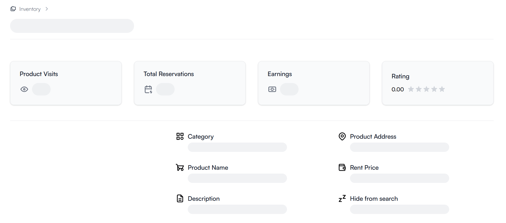
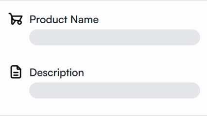

# next-suspend

The `suspend` utility runs your data resolver function through `React.cache` using your Next.js page `params` as the cache keys.
It returns an enhanced `<Suspense>` component, which awaits the `params` and renders the resolved value through a children prop.

```
npm i next-suspend
```

## Motivation

The `suspend` utility makes it easy to build layouts where it appears that individual values are suspended, but in practice only one entity is awaited:



## Usage

```tsx
import { suspend } from "next-suspend";

// 1. Setup your data query:
export const { Suspend: Product } = suspend(
  async ({ productId }: { productId: string }) => {
    const product = await db.select.productById({ productId });
    if (!product) {
      notFound();
    }
    return product;
  },
);

// 2. Pass the params & render values suspensefully:
export default function Page({ params }: PageProps<"/market/[productId]">) {
  return (
    <>
      <Property icon={<TbGardenCart />}>
        <PropertyTitle>Product</PropertyTitle>
        <PropertyValue>
          <Product params={params} fallback={<SkeletonLine />}>
            {({ name }) => <span>{name}</span>}
          </Product>
        </PropertyValue>
      </Property>
      <Property icon={<TbGardenCart />}>
        <PropertyTitle>Description</PropertyTitle>
        <PropertyValue>
          <Product params={params} fallback={<SkeletonLine />}>
            {({ description }) => <span>{description}</span>}
          </Product>
        </PropertyValue>
      </Property>
    </>
  );
}
```

Your query will run once per params. The page can now render the titles (Product & Description) into a static shell for an instant navigation:

## Usage w/ client components

Your suspend query [can be streamed to the client](https://nextjs.org/docs/app/guides/single-page-applications#using-reacts-use-within-a-context-provider) with the `useSuspend()` hook consuming a promise from a context provider:

```tsx
// app/market/[productId]/product.ts
import { suspend } from "next-suspend";

const { queryCache, Provider } = suspend(
  async ({ productId }: { productId: string }) => {
    // query the product
  },
);

// 1. export the Provider and the result type:
export const ProductProvider = Provider;
export type Product = Awaited<ReturnType<typeof queryCache>>;
```

```tsx
// app/market/[productId]/layout.tsx
import { ProductProvider } from "./product";

// 2. Use the Provider in the layout:
export default function ProductLayout({
  params,
  children,
}: LayoutProps<"/market/[productId]">) {
  return <ProductProvider params={params}>{children}</ProductProvider>;
}
```

```tsx
// app/market/[productId]/components.tsx
import { useSuspend } from "next-suspend";
import type { Product } from "./product";

// 3. Type the context value:
export function useProduct() {
  return useSuspend() as Product;
}
```

```tsx
// app/market/[productId]/components.tsx
"use client";

// 4. Consume the hook in your client components:
function Name() {
  const product = useProduct();
  return <span>{product.name}</span>;
}

export function ProductName() {
  return (
    <Suspense fallback={<SkeletonLine />}>
      <Name />
    </Suspense>
  );
}
```

```tsx
// app/market/[productId]/page.tsx
import { ProductName } from "./components";
import { ProductDescription } from "./components";

// 5. Finally render the components on a page:
export default function ProductPage() {
  return (
    <>
      <Property icon={<TbGardenCart />}>
        <PropertyTitle>Product</PropertyTitle>
        <PropertyValue>
          <ProductName />
        </PropertyValue>
      </Property>
      <Property icon={<TbGardenCart />}>
        <PropertyTitle>Description</PropertyTitle>
        <PropertyValue>
          <ProductDescription />
        </PropertyValue>
      </Property>
    </>
  );
}
```



## Helper types

Simplify the data resolvers, so their params are typed by your routes:

```ts
// 1. Define a global helper type
import type { AppRoutes } from "@/../.next/types/routes";

declare global {
  type Suspended<Route extends AppRoutes> = Awaited<PageProps<Route>["params"]>;
}

// 2. Get params by Page
const SuspendedProduct = suspend(
  async ({ productId }: Suspended<"/market/[productId]">) => {
    // ...
  },
);
```
